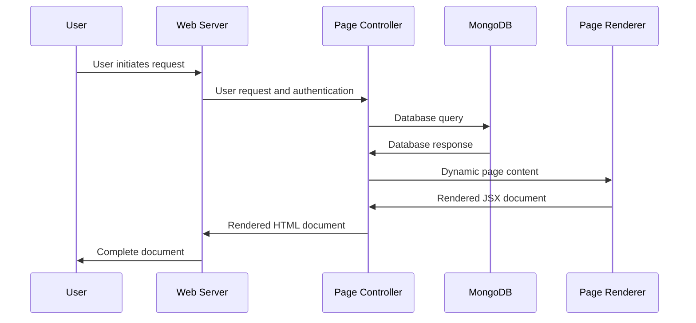

# Development of video-platform

## Modules

The video-platform codebase uses several modules. The basic flow of
information between these modules can be illustrated as follows:

The source code of these modules are located in the following
locations:

| Module           | Location               |
| :--------------- | :--------------------- |
| Web Server       | `src/index.ts`         |
| Page Controllers | `src/pages/*.ts`       |
| Page Renderers   | `src/components/*.tsx` |
| MongoDB          | `src/mongodb.ts`       |

Documenation for various functions is available at https://uaf-cs-f372-the-ethical-group.github.io/video-platform
